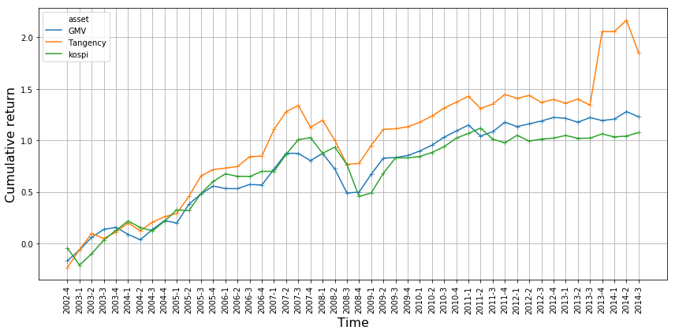
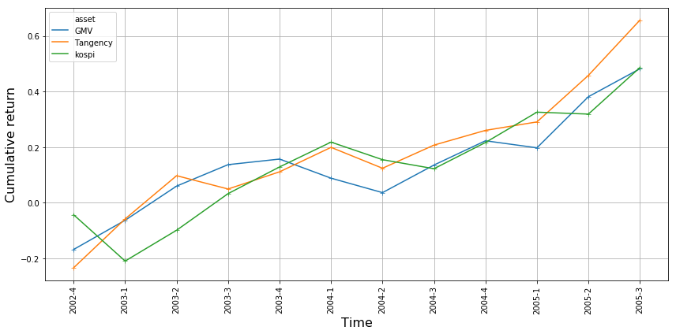
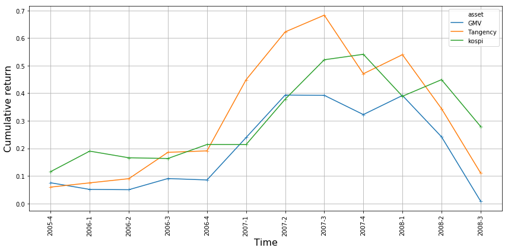
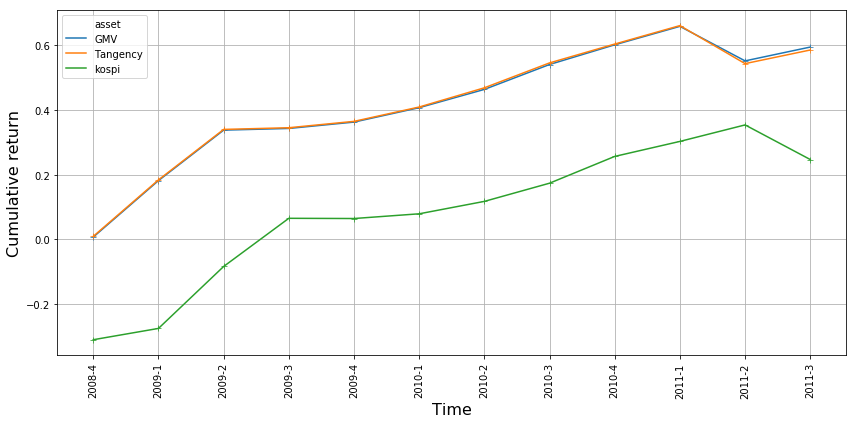
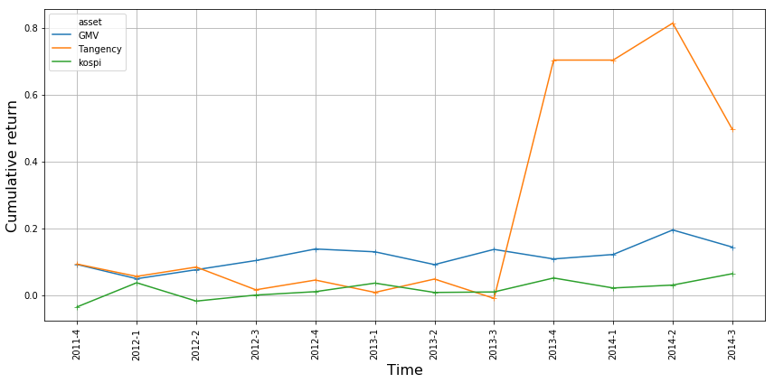
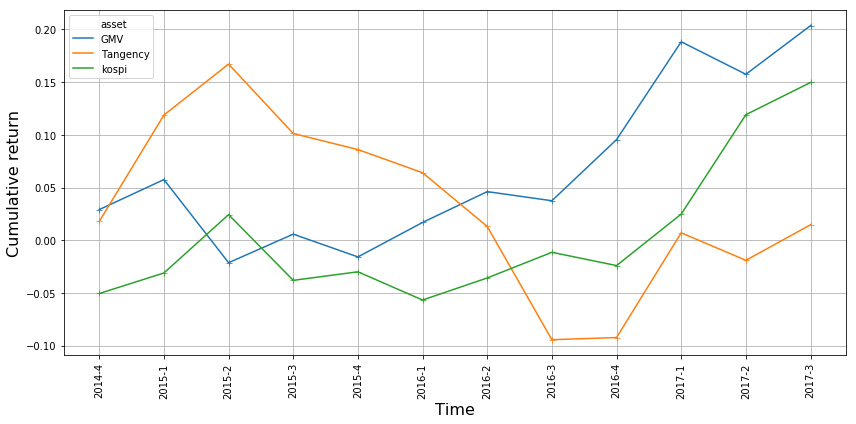

# Clustering-based Stock Portfolio
1. [Data preprocessing](#01.-Data-Preprocessing)
2. [Main](#02.-Main)
3. [Analysis](#03.-Analysis)


```python
from src.preprocessing_utils import *
from src.clustering import *
from src.portfolio import *
from functools import reduce
import pandas as pd
import numpy as np
import seaborn.apionly as sns
import matplotlib.pyplot as plt
import os
import pickle
```

---

## 01. Data Preprocessing
### `scripts/01_data-preprocessing.R` $\rightarrow$ `scripts/preprocess.py`

### Stock data


```python
path = os.path.join("data", "raw")
file_names = ["asset", "asset-growth", "equity", "equity-turnover",
              "leverage", "market-cap", "net-profit", "pcr", "per",
              "stock-number", "stock-price", "trade-amount", "volatility"]
var_names = ["asset", "asset_growth", "equity", "equity_turnover",
             "leverage", "market_cap", "net_profit", "pcr", "per",
             "stock_num", "price", "trade_amount", "volatility"]
extension = ".xls"
```


```python
stock_tbl = preprocess(path, file_names, var_names, extension=".xls")
stock_tbl.head()
```

    asset, asset-growth, equity, equity-turnover, leverage, market-cap, net-profit, pcr, per, stock-number, stock-price, trade-amount, volatility,


<div>
<style scoped>
    .dataframe tbody tr th:only-of-type {
        vertical-align: middle;
    }

    .dataframe tbody tr th {
        vertical-align: top;
    }

    .dataframe thead th {
        text-align: right;
    }
</style>
<table border="1" class="dataframe">
  <thead>
    <tr style="text-align: right;">
      <th></th>
      <th>code</th>
      <th>time</th>
      <th>leverage</th>
      <th>asset_growth</th>
      <th>shares_turnover</th>
      <th>roa</th>
      <th>roe</th>
      <th>size</th>
      <th>pcr</th>
      <th>per</th>
      <th>equity_turnover</th>
      <th>volatility</th>
      <th>logret</th>
    </tr>
  </thead>
  <tbody>
    <tr>
      <th>0</th>
      <td>000020</td>
      <td>1997-1</td>
      <td>NaN</td>
      <td>NaN</td>
      <td>0.006314</td>
      <td>NaN</td>
      <td>NaN</td>
      <td>8.850400e+10</td>
      <td>NaN</td>
      <td>15.586667</td>
      <td>NaN</td>
      <td>60.255281</td>
      <td>NaN</td>
    </tr>
    <tr>
      <th>1</th>
      <td>000020</td>
      <td>1997-2</td>
      <td>206.92</td>
      <td>23.60</td>
      <td>0.015739</td>
      <td>0.002507</td>
      <td>0.007696</td>
      <td>1.104880e+11</td>
      <td>NaN</td>
      <td>11.053333</td>
      <td>2.22</td>
      <td>62.004616</td>
      <td>0.235505</td>
    </tr>
    <tr>
      <th>2</th>
      <td>000020</td>
      <td>1997-3</td>
      <td>NaN</td>
      <td>NaN</td>
      <td>0.004035</td>
      <td>NaN</td>
      <td>NaN</td>
      <td>1.087867e+11</td>
      <td>NaN</td>
      <td>10.543333</td>
      <td>NaN</td>
      <td>56.334550</td>
      <td>-0.040738</td>
    </tr>
    <tr>
      <th>3</th>
      <td>000020</td>
      <td>1997-4</td>
      <td>324.23</td>
      <td>12.41</td>
      <td>0.004633</td>
      <td>0.009214</td>
      <td>0.039088</td>
      <td>4.613333e+10</td>
      <td>NaN</td>
      <td>4.346667</td>
      <td>2.89</td>
      <td>62.702979</td>
      <td>-0.847219</td>
    </tr>
    <tr>
      <th>4</th>
      <td>000020</td>
      <td>1998-1</td>
      <td>NaN</td>
      <td>NaN</td>
      <td>0.012191</td>
      <td>NaN</td>
      <td>NaN</td>
      <td>5.973333e+10</td>
      <td>NaN</td>
      <td>4.750000</td>
      <td>NaN</td>
      <td>73.726084</td>
      <td>0.120535</td>
    </tr>
  </tbody>
</table>
</div>


### KOSPI index


```python
def unpack_df(df):
    df = df.reset_index()
    df["time"] = df[['time', 'level_1']].astype(str).apply(lambda x: '-'.join(x), axis=1)
    df = pd.concat([df.time, df.price], axis=1)
    df.columns = ["time", "logret"]
    return df
```


```python
kospi = pd.read_excel("data/raw/kospi-index.xlsx", names=["time", "price"])
g = kospi.groupby([pd.DatetimeIndex(kospi.time).year, as_quarter(pd.DatetimeIndex(kospi.time).month)])
g = np.log(g.mean()).diff()
kospi = unpack_df(g)
kospi.head()
```


<div>
<style scoped>
    .dataframe tbody tr th:only-of-type {
        vertical-align: middle;
    }

    .dataframe tbody tr th {
        vertical-align: top;
    }

    .dataframe thead th {
        text-align: right;
    }
</style>
<table border="1" class="dataframe">
  <thead>
    <tr style="text-align: right;">
      <th></th>
      <th>time</th>
      <th>logret</th>
    </tr>
  </thead>
  <tbody>
    <tr>
      <th>0</th>
      <td>1997-1</td>
      <td>NaN</td>
    </tr>
    <tr>
      <th>1</th>
      <td>1997-2</td>
      <td>0.082477</td>
    </tr>
    <tr>
      <th>2</th>
      <td>1997-3</td>
      <td>-0.064037</td>
    </tr>
    <tr>
      <th>3</th>
      <td>1997-4</td>
      <td>-0.499768</td>
    </tr>
    <tr>
      <th>4</th>
      <td>1998-1</td>
      <td>0.247514</td>
    </tr>
  </tbody>
</table>
</div>


### Risk-free rate


```python
risk_free = pd.read_excel("data/raw/cd-risk-free.xlsx", names=["time", "r"])
risk_free.time = risk_free.time.str.replace("/", "-").str.split().str[0]
risk_free.r = np.log(1 + risk_free.r / 100)
risk_free.head()
```


<div>
<style scoped>
    .dataframe tbody tr th:only-of-type {
        vertical-align: middle;
    }

    .dataframe tbody tr th {
        vertical-align: top;
    }

    .dataframe thead th {
        text-align: right;
    }
</style>
<table border="1" class="dataframe">
  <thead>
    <tr style="text-align: right;">
      <th></th>
      <th>time</th>
      <th>r</th>
    </tr>
  </thead>
  <tbody>
    <tr>
      <th>0</th>
      <td>1997-1</td>
      <td>0.119707</td>
    </tr>
    <tr>
      <th>1</th>
      <td>1997-2</td>
      <td>0.118287</td>
    </tr>
    <tr>
      <th>2</th>
      <td>1997-3</td>
      <td>0.119115</td>
    </tr>
    <tr>
      <th>3</th>
      <td>1997-4</td>
      <td>0.145110</td>
    </tr>
    <tr>
      <th>4</th>
      <td>1998-1</td>
      <td>0.204599</td>
    </tr>
  </tbody>
</table>
</div>


### Save processed data
import os
os.mkdir("data/processed")

```python
stock_tbl.to_csv("data/processed/stock2.csv", index=False)
kospi.to_csv("data/processed/kospi2.csv", index=False)
risk_free.to_csv("data/processed/risk_free2.csv", index=False)
```


```python

```

---

## 02. Main
### `scripts/02_main.R` $\rightarrow$ `scripts/main.py`

### Random state


```python
random_state = 0
```

### Load data


```python
stock_tbl = pd.read_csv("data/processed/stock.csv")
kospi = pd.read_csv("data/processed/kospi.csv")
risk_free = pd.read_csv("data/processed/risk_free.csv")
```

### Models


```python
with_list = [
    "return",
    "market_residual",
    "factors",
    "factors_residual"
]
n_time_list = [
    6, 8,
    10, 12
]
method_list = [
    "GMV", "Tangency"
]
```

### Validation period


```python
start_list = ["2002-4", "2005-4", "2008-4", "2011-4"]
end_list = ["2005-3", "2008-3", "2011-3", "2014-3"]
valid_res = []

for st, en in zip(start_list, end_list):
    valid_res.append(evaluate_portfolio(stock_tbl, kospi, risk_free, st, en,
                                        with_list, n_time_list, method_list,
                                        random_state=random_state))
```

    from 2002-4 to 2005-3
      with: return
      n_time: 6
      method: GMV


    100%|██████████████████████████████████████████████████████████████████████████████████| 12/12 [00:23<00:00,  1.91s/it]


      with: return
      n_time: 6
      method: Tangency


    100%|██████████████████████████████████████████████████████████████████████████████████| 12/12 [00:22<00:00,  1.90s/it]


      with: return
      n_time: 8
      method: GMV


    100%|██████████████████████████████████████████████████████████████████████████████████| 12/12 [00:30<00:00,  2.50s/it]


      with: return
      n_time: 8
      method: Tangency


    100%|██████████████████████████████████████████████████████████████████████████████████| 12/12 [00:29<00:00,  2.48s/it]


      with: return
      n_time: 10
      method: GMV


    100%|██████████████████████████████████████████████████████████████████████████████████| 12/12 [00:38<00:00,  3.12s/it]


      with: return
      n_time: 10
      method: Tangency


    100%|██████████████████████████████████████████████████████████████████████████████████| 12/12 [00:37<00:00,  3.13s/it]


      with: return
      n_time: 12
      method: GMV


    100%|██████████████████████████████████████████████████████████████████████████████████| 12/12 [00:45<00:00,  3.86s/it]


      with: return
      n_time: 12
      method: Tangency


    100%|██████████████████████████████████████████████████████████████████████████████████| 12/12 [00:44<00:00,  3.72s/it]


      with: market_residual
      n_time: 6
      method: GMV


    100%|██████████████████████████████████████████████████████████████████████████████████| 12/12 [01:17<00:00,  6.56s/it]


      with: market_residual
      n_time: 6
      method: Tangency


    100%|██████████████████████████████████████████████████████████████████████████████████| 12/12 [01:27<00:00,  7.51s/it]


      with: market_residual
      n_time: 8
      method: GMV


    100%|██████████████████████████████████████████████████████████████████████████████████| 12/12 [01:35<00:00,  7.20s/it]


      with: market_residual
      n_time: 8
      method: Tangency


    100%|██████████████████████████████████████████████████████████████████████████████████| 12/12 [01:25<00:00,  7.11s/it]


      with: market_residual
      n_time: 10
      method: GMV


    100%|██████████████████████████████████████████████████████████████████████████████████| 12/12 [01:32<00:00,  7.88s/it]


      with: market_residual
      n_time: 10
      method: Tangency


    100%|██████████████████████████████████████████████████████████████████████████████████| 12/12 [01:32<00:00,  7.72s/it]


      with: market_residual
      n_time: 12
      method: GMV


    100%|██████████████████████████████████████████████████████████████████████████████████| 12/12 [01:41<00:00,  8.46s/it]


      with: market_residual
      n_time: 12
      method: Tangency


    100%|██████████████████████████████████████████████████████████████████████████████████| 12/12 [01:40<00:00,  8.39s/it]


      with: factors
      n_time: 6
      method: GMV


    100%|██████████████████████████████████████████████████████████████████████████████████| 12/12 [00:10<00:00,  1.10it/s]


      with: factors
      n_time: 6
      method: Tangency


    100%|██████████████████████████████████████████████████████████████████████████████████| 12/12 [00:10<00:00,  1.11it/s]


      with: factors
      n_time: 8
      method: GMV


    100%|██████████████████████████████████████████████████████████████████████████████████| 12/12 [00:13<00:00,  1.14s/it]


      with: factors
      n_time: 8
      method: Tangency


    100%|██████████████████████████████████████████████████████████████████████████████████| 12/12 [00:13<00:00,  1.15s/it]


      with: factors
      n_time: 10
      method: GMV


    100%|██████████████████████████████████████████████████████████████████████████████████| 12/12 [00:16<00:00,  1.48s/it]


      with: factors
      n_time: 10
      method: Tangency


    100%|██████████████████████████████████████████████████████████████████████████████████| 12/12 [00:16<00:00,  1.42s/it]


      with: factors
      n_time: 12
      method: GMV


    100%|██████████████████████████████████████████████████████████████████████████████████| 12/12 [00:20<00:00,  1.77s/it]


      with: factors
      n_time: 12
      method: Tangency


    100%|██████████████████████████████████████████████████████████████████████████████████| 12/12 [00:20<00:00,  1.76s/it]


      with: factors_residual
      n_time: 6
      method: GMV


    100%|██████████████████████████████████████████████████████████████████████████████████| 12/12 [01:46<00:00,  8.82s/it]


      with: factors_residual
      n_time: 6
      method: Tangency


    100%|██████████████████████████████████████████████████████████████████████████████████| 12/12 [01:46<00:00,  8.87s/it]


      with: factors_residual
      n_time: 8
      method: GMV


    100%|██████████████████████████████████████████████████████████████████████████████████| 12/12 [01:54<00:00,  9.57s/it]


      with: factors_residual
      n_time: 8
      method: Tangency


    100%|██████████████████████████████████████████████████████████████████████████████████| 12/12 [01:55<00:00,  9.59s/it]


      with: factors_residual
      n_time: 10
      method: GMV


    100%|██████████████████████████████████████████████████████████████████████████████████| 12/12 [02:03<00:00, 10.32s/it]


      with: factors_residual
      n_time: 10
      method: Tangency


    100%|██████████████████████████████████████████████████████████████████████████████████| 12/12 [02:03<00:00, 10.31s/it]


      with: factors_residual
      n_time: 12
      method: GMV


    100%|██████████████████████████████████████████████████████████████████████████████████| 12/12 [02:11<00:00, 10.97s/it]


      with: factors_residual
      n_time: 12
      method: Tangency


    100%|██████████████████████████████████████████████████████████████████████████████████| 12/12 [02:14<00:00, 11.87s/it]


    from 2005-4 to 2008-3
      with: return
      n_time: 6
      method: GMV


    100%|██████████████████████████████████████████████████████████████████████████████████| 12/12 [00:25<00:00,  2.12s/it]


      with: return
      n_time: 6
      method: Tangency


    100%|██████████████████████████████████████████████████████████████████████████████████| 12/12 [00:24<00:00,  2.05s/it]


      with: return
      n_time: 8
      method: GMV


    100%|██████████████████████████████████████████████████████████████████████████████████| 12/12 [00:33<00:00,  2.72s/it]


      with: return
      n_time: 8
      method: Tangency


    100%|██████████████████████████████████████████████████████████████████████████████████| 12/12 [00:32<00:00,  2.72s/it]


      with: return
      n_time: 10
      method: GMV


    100%|██████████████████████████████████████████████████████████████████████████████████| 12/12 [00:40<00:00,  3.40s/it]


      with: return
      n_time: 10
      method: Tangency


    100%|██████████████████████████████████████████████████████████████████████████████████| 12/12 [00:41<00:00,  3.48s/it]


      with: return
      n_time: 12
      method: GMV


    100%|██████████████████████████████████████████████████████████████████████████████████| 12/12 [00:49<00:00,  4.11s/it]


      with: return
      n_time: 12
      method: Tangency


    100%|██████████████████████████████████████████████████████████████████████████████████| 12/12 [00:49<00:00,  4.13s/it]


      with: market_residual
      n_time: 6
      method: GMV


    100%|██████████████████████████████████████████████████████████████████████████████████| 12/12 [01:23<00:00,  6.89s/it]


      with: market_residual
      n_time: 6
      method: Tangency


    100%|██████████████████████████████████████████████████████████████████████████████████| 12/12 [01:23<00:00,  6.92s/it]


      with: market_residual
      n_time: 8
      method: GMV


    100%|██████████████████████████████████████████████████████████████████████████████████| 12/12 [01:31<00:00,  7.72s/it]


      with: market_residual
      n_time: 8
      method: Tangency


    100%|██████████████████████████████████████████████████████████████████████████████████| 12/12 [01:30<00:00,  7.56s/it]


      with: market_residual
      n_time: 10
      method: GMV


    100%|██████████████████████████████████████████████████████████████████████████████████| 12/12 [01:40<00:00,  8.33s/it]


      with: market_residual
      n_time: 10
      method: Tangency


    100%|██████████████████████████████████████████████████████████████████████████████████| 12/12 [01:40<00:00,  8.30s/it]


      with: market_residual
      n_time: 12
      method: GMV


    100%|██████████████████████████████████████████████████████████████████████████████████| 12/12 [01:48<00:00,  9.05s/it]


      with: market_residual
      n_time: 12
      method: Tangency


    100%|██████████████████████████████████████████████████████████████████████████████████| 12/12 [01:48<00:00,  9.06s/it]


      with: factors
      n_time: 6
      method: GMV


    100%|██████████████████████████████████████████████████████████████████████████████████| 12/12 [00:12<00:00,  1.08s/it]


      with: factors
      n_time: 6
      method: Tangency


    100%|██████████████████████████████████████████████████████████████████████████████████| 12/12 [00:12<00:00,  1.07s/it]


      with: factors
      n_time: 8
      method: GMV


    100%|██████████████████████████████████████████████████████████████████████████████████| 12/12 [00:15<00:00,  1.34s/it]


      with: factors
      n_time: 8
      method: Tangency


    100%|██████████████████████████████████████████████████████████████████████████████████| 12/12 [00:16<00:00,  1.35s/it]


      with: factors
      n_time: 10
      method: GMV


    100%|██████████████████████████████████████████████████████████████████████████████████| 12/12 [00:19<00:00,  1.64s/it]


      with: factors
      n_time: 10
      method: Tangency


    100%|██████████████████████████████████████████████████████████████████████████████████| 12/12 [00:20<00:00,  1.64s/it]


      with: factors
      n_time: 12
      method: GMV


    100%|██████████████████████████████████████████████████████████████████████████████████| 12/12 [00:22<00:00,  1.94s/it]


      with: factors
      n_time: 12
      method: Tangency


    100%|██████████████████████████████████████████████████████████████████████████████████| 12/12 [00:23<00:00,  1.95s/it]


      with: factors_residual
      n_time: 6
      method: GMV


    100%|██████████████████████████████████████████████████████████████████████████████████| 12/12 [01:46<00:00,  8.82s/it]


      with: factors_residual
      n_time: 6
      method: Tangency


    100%|██████████████████████████████████████████████████████████████████████████████████| 12/12 [01:46<00:00,  8.86s/it]


      with: factors_residual
      n_time: 8
      method: GMV


    100%|██████████████████████████████████████████████████████████████████████████████████| 12/12 [01:54<00:00,  9.58s/it]


      with: factors_residual
      n_time: 8
      method: Tangency


    100%|██████████████████████████████████████████████████████████████████████████████████| 12/12 [01:55<00:00,  9.61s/it]


      with: factors_residual
      n_time: 10
      method: GMV


    100%|██████████████████████████████████████████████████████████████████████████████████| 12/12 [02:03<00:00, 10.32s/it]


      with: factors_residual
      n_time: 10
      method: Tangency


    100%|██████████████████████████████████████████████████████████████████████████████████| 12/12 [02:03<00:00, 10.28s/it]


      with: factors_residual
      n_time: 12
      method: GMV


    100%|██████████████████████████████████████████████████████████████████████████████████| 12/12 [02:12<00:00, 10.99s/it]


      with: factors_residual
      n_time: 12
      method: Tangency


    100%|██████████████████████████████████████████████████████████████████████████████████| 12/12 [02:12<00:00, 11.02s/it]


    from 2008-4 to 2011-3
      with: return
      n_time: 6
      method: GMV


    100%|██████████████████████████████████████████████████████████████████████████████████| 12/12 [00:24<00:00,  2.05s/it]


      with: return
      n_time: 6
      method: Tangency


    100%|██████████████████████████████████████████████████████████████████████████████████| 12/12 [00:24<00:00,  2.09s/it]


      with: return
      n_time: 8
      method: GMV


    100%|██████████████████████████████████████████████████████████████████████████████████| 12/12 [00:33<00:00,  2.75s/it]


      with: return
      n_time: 8
      method: Tangency


    100%|██████████████████████████████████████████████████████████████████████████████████| 12/12 [00:32<00:00,  2.73s/it]


      with: return
      n_time: 10
      method: GMV


    100%|██████████████████████████████████████████████████████████████████████████████████| 12/12 [00:41<00:00,  3.41s/it]


      with: return
      n_time: 10
      method: Tangency


    100%|██████████████████████████████████████████████████████████████████████████████████| 12/12 [00:41<00:00,  3.46s/it]


      with: return
      n_time: 12
      method: GMV


    100%|██████████████████████████████████████████████████████████████████████████████████| 12/12 [00:48<00:00,  4.08s/it]


      with: return
      n_time: 12
      method: Tangency


    100%|██████████████████████████████████████████████████████████████████████████████████| 12/12 [00:49<00:00,  4.11s/it]


      with: market_residual
      n_time: 6
      method: GMV


    100%|██████████████████████████████████████████████████████████████████████████████████| 12/12 [01:23<00:00,  6.95s/it]


      with: market_residual
      n_time: 6
      method: Tangency


    100%|██████████████████████████████████████████████████████████████████████████████████| 12/12 [01:23<00:00,  6.95s/it]


      with: market_residual
      n_time: 8
      method: GMV


    100%|██████████████████████████████████████████████████████████████████████████████████| 12/12 [01:32<00:00,  7.72s/it]


      with: market_residual
      n_time: 8
      method: Tangency


    100%|██████████████████████████████████████████████████████████████████████████████████| 12/12 [01:31<00:00,  7.63s/it]


      with: market_residual
      n_time: 10
      method: GMV


    100%|██████████████████████████████████████████████████████████████████████████████████| 12/12 [01:40<00:00,  8.35s/it]


      with: market_residual
      n_time: 10
      method: Tangency


    100%|██████████████████████████████████████████████████████████████████████████████████| 12/12 [01:41<00:00,  8.47s/it]


      with: market_residual
      n_time: 12
      method: GMV


    100%|██████████████████████████████████████████████████████████████████████████████████| 12/12 [01:49<00:00,  9.10s/it]


      with: market_residual
      n_time: 12
      method: Tangency


    100%|██████████████████████████████████████████████████████████████████████████████████| 12/12 [01:49<00:00,  9.06s/it]


      with: factors
      n_time: 6
      method: GMV


    100%|██████████████████████████████████████████████████████████████████████████████████| 12/12 [00:13<00:00,  1.14s/it]


      with: factors
      n_time: 6
      method: Tangency


    100%|██████████████████████████████████████████████████████████████████████████████████| 12/12 [00:12<00:00,  1.12s/it]


      with: factors
      n_time: 8
      method: GMV


    100%|██████████████████████████████████████████████████████████████████████████████████| 12/12 [00:16<00:00,  1.42s/it]


      with: factors
      n_time: 8
      method: Tangency


    100%|██████████████████████████████████████████████████████████████████████████████████| 12/12 [00:16<00:00,  1.41s/it]


      with: factors
      n_time: 10
      method: GMV


    100%|██████████████████████████████████████████████████████████████████████████████████| 12/12 [00:20<00:00,  1.80s/it]


      with: factors
      n_time: 10
      method: Tangency


    100%|██████████████████████████████████████████████████████████████████████████████████| 12/12 [00:20<00:00,  1.72s/it]


      with: factors
      n_time: 12
      method: GMV


    100%|██████████████████████████████████████████████████████████████████████████████████| 12/12 [00:23<00:00,  2.01s/it]


      with: factors
      n_time: 12
      method: Tangency


    100%|██████████████████████████████████████████████████████████████████████████████████| 12/12 [00:23<00:00,  2.00s/it]


      with: factors_residual
      n_time: 6
      method: GMV


    100%|██████████████████████████████████████████████████████████████████████████████████| 12/12 [01:46<00:00,  8.84s/it]


      with: factors_residual
      n_time: 6
      method: Tangency


    100%|██████████████████████████████████████████████████████████████████████████████████| 12/12 [01:46<00:00,  8.89s/it]


      with: factors_residual
      n_time: 8
      method: GMV


    100%|██████████████████████████████████████████████████████████████████████████████████| 12/12 [01:59<00:00,  9.68s/it]


      with: factors_residual
      n_time: 8
      method: Tangency


    100%|██████████████████████████████████████████████████████████████████████████████████| 12/12 [01:55<00:00,  9.62s/it]


      with: factors_residual
      n_time: 10
      method: GMV


    100%|██████████████████████████████████████████████████████████████████████████████████| 12/12 [02:04<00:00, 10.30s/it]


      with: factors_residual
      n_time: 10
      method: Tangency


    100%|██████████████████████████████████████████████████████████████████████████████████| 12/12 [02:03<00:00, 10.31s/it]


      with: factors_residual
      n_time: 12
      method: GMV


    100%|██████████████████████████████████████████████████████████████████████████████████| 12/12 [02:12<00:00, 10.99s/it]


      with: factors_residual
      n_time: 12
      method: Tangency


    100%|██████████████████████████████████████████████████████████████████████████████████| 12/12 [02:12<00:00, 10.99s/it]
    C:\Users\user\Desktop\clustering-based-stock-portfolio\src\portfolio.py:96: RuntimeWarning: invalid value encountered in sqrt
      pr_sd = np.diag(np.sqrt(pr_tbl.iloc[:, 2:].cov()))


    from 2011-4 to 2014-3
      with: return
      n_time: 6
      method: GMV


    100%|██████████████████████████████████████████████████████████████████████████████████| 12/12 [00:25<00:00,  2.10s/it]


      with: return
      n_time: 6
      method: Tangency


    100%|██████████████████████████████████████████████████████████████████████████████████| 12/12 [00:26<00:00,  2.21s/it]


      with: return
      n_time: 8
      method: GMV


    100%|██████████████████████████████████████████████████████████████████████████████████| 12/12 [00:33<00:00,  2.79s/it]


      with: return
      n_time: 8
      method: Tangency


    100%|██████████████████████████████████████████████████████████████████████████████████| 12/12 [00:33<00:00,  2.78s/it]


      with: return
      n_time: 10
      method: GMV


    100%|██████████████████████████████████████████████████████████████████████████████████| 12/12 [00:41<00:00,  3.48s/it]


      with: return
      n_time: 10
      method: Tangency


    100%|██████████████████████████████████████████████████████████████████████████████████| 12/12 [00:43<00:00,  3.51s/it]


      with: return
      n_time: 12
      method: GMV


    100%|██████████████████████████████████████████████████████████████████████████████████| 12/12 [00:49<00:00,  4.12s/it]


      with: return
      n_time: 12
      method: Tangency


    100%|██████████████████████████████████████████████████████████████████████████████████| 12/12 [00:50<00:00,  4.19s/it]


      with: market_residual
      n_time: 6
      method: GMV


    100%|██████████████████████████████████████████████████████████████████████████████████| 12/12 [01:23<00:00,  6.97s/it]


      with: market_residual
      n_time: 6
      method: Tangency


    100%|██████████████████████████████████████████████████████████████████████████████████| 12/12 [01:25<00:00,  7.04s/it]


      with: market_residual
      n_time: 8
      method: GMV


    100%|██████████████████████████████████████████████████████████████████████████████████| 12/12 [01:32<00:00,  7.72s/it]


      with: market_residual
      n_time: 8
      method: Tangency


    100%|██████████████████████████████████████████████████████████████████████████████████| 12/12 [01:33<00:00,  7.87s/it]


      with: market_residual
      n_time: 10
      method: GMV


    100%|██████████████████████████████████████████████████████████████████████████████████| 12/12 [01:40<00:00,  8.38s/it]


      with: market_residual
      n_time: 10
      method: Tangency


    100%|██████████████████████████████████████████████████████████████████████████████████| 12/12 [01:41<00:00,  8.41s/it]


      with: market_residual
      n_time: 12
      method: GMV


    100%|██████████████████████████████████████████████████████████████████████████████████| 12/12 [01:52<00:00,  9.20s/it]


      with: market_residual
      n_time: 12
      method: Tangency


    100%|██████████████████████████████████████████████████████████████████████████████████| 12/12 [01:50<00:00,  9.15s/it]


      with: factors
      n_time: 6
      method: GMV


    100%|██████████████████████████████████████████████████████████████████████████████████| 12/12 [00:14<00:00,  1.19s/it]


      with: factors
      n_time: 6
      method: Tangency


    100%|██████████████████████████████████████████████████████████████████████████████████| 12/12 [00:14<00:00,  1.20s/it]


      with: factors
      n_time: 8
      method: GMV


    100%|██████████████████████████████████████████████████████████████████████████████████| 12/12 [00:19<00:00,  1.61s/it]


      with: factors
      n_time: 8
      method: Tangency


    100%|██████████████████████████████████████████████████████████████████████████████████| 12/12 [00:18<00:00,  1.55s/it]


      with: factors
      n_time: 10
      method: GMV


    100%|██████████████████████████████████████████████████████████████████████████████████| 12/12 [00:22<00:00,  1.90s/it]


      with: factors
      n_time: 10
      method: Tangency


    100%|██████████████████████████████████████████████████████████████████████████████████| 12/12 [00:22<00:00,  1.89s/it]


      with: factors
      n_time: 12
      method: GMV


    100%|██████████████████████████████████████████████████████████████████████████████████| 12/12 [00:26<00:00,  2.26s/it]


      with: factors
      n_time: 12
      method: Tangency


    100%|██████████████████████████████████████████████████████████████████████████████████| 12/12 [00:27<00:00,  2.37s/it]


      with: factors_residual
      n_time: 6
      method: GMV


    100%|██████████████████████████████████████████████████████████████████████████████████| 12/12 [01:46<00:00,  8.90s/it]


      with: factors_residual
      n_time: 6
      method: Tangency


    100%|██████████████████████████████████████████████████████████████████████████████████| 12/12 [01:48<00:00,  8.88s/it]


      with: factors_residual
      n_time: 8
      method: GMV


    100%|██████████████████████████████████████████████████████████████████████████████████| 12/12 [01:55<00:00,  9.56s/it]


      with: factors_residual
      n_time: 8
      method: Tangency


    100%|██████████████████████████████████████████████████████████████████████████████████| 12/12 [01:55<00:00,  9.55s/it]


      with: factors_residual
      n_time: 10
      method: GMV


    100%|██████████████████████████████████████████████████████████████████████████████████| 12/12 [02:03<00:00, 10.27s/it]


      with: factors_residual
      n_time: 10
      method: Tangency


    100%|██████████████████████████████████████████████████████████████████████████████████| 12/12 [02:04<00:00, 10.28s/it]


      with: factors_residual
      n_time: 12
      method: GMV


    100%|██████████████████████████████████████████████████████████████████████████████████| 12/12 [02:12<00:00, 11.01s/it]


      with: factors_residual
      n_time: 12
      method: Tangency


    100%|██████████████████████████████████████████████████████████████████████████████████| 12/12 [02:13<00:00, 11.22s/it]
    C:\Users\user\Desktop\clustering-based-stock-portfolio\src\portfolio.py:96: RuntimeWarning: invalid value encountered in sqrt
      pr_sd = np.diag(np.sqrt(pr_tbl.iloc[:, 2:].cov()))


```python
valid_res[0]["return"].head()
```


<div>
<style scoped>
    .dataframe tbody tr th:only-of-type {
        vertical-align: middle;
    }

    .dataframe tbody tr th {
        vertical-align: top;
    }

    .dataframe thead th {
        text-align: right;
    }
</style>
<table border="1" class="dataframe">
  <thead>
    <tr style="text-align: right;">
      <th></th>
      <th>time</th>
      <th>kospi</th>
      <th>market_residual_6_GMV</th>
      <th>market_residual_8_GMV</th>
    </tr>
  </thead>
  <tbody>
    <tr>
      <th>0</th>
      <td>2002-4</td>
      <td>-0.043557</td>
      <td>-0.182029</td>
      <td>-0.168141</td>
    </tr>
    <tr>
      <th>1</th>
      <td>2003-1</td>
      <td>-0.166381</td>
      <td>0.150088</td>
      <td>0.133076</td>
    </tr>
    <tr>
      <th>2</th>
      <td>2003-2</td>
      <td>0.110888</td>
      <td>0.033397</td>
      <td>0.123056</td>
    </tr>
    <tr>
      <th>3</th>
      <td>2003-3</td>
      <td>0.131688</td>
      <td>0.120947</td>
      <td>0.070731</td>
    </tr>
    <tr>
      <th>4</th>
      <td>2003-4</td>
      <td>0.096017</td>
      <td>0.013463</td>
      <td>0.015975</td>
    </tr>
  </tbody>
</table>
</div>


```python
valid_res[0]["summary"]
```


<div>
<style scoped>
    .dataframe tbody tr th:only-of-type {
        vertical-align: middle;
    }

    .dataframe tbody tr th {
        vertical-align: top;
    }

    .dataframe thead th {
        text-align: right;
    }
</style>
<table border="1" class="dataframe">
  <thead>
    <tr style="text-align: right;">
      <th></th>
      <th>with</th>
      <th>n_time</th>
      <th>method</th>
      <th>cumsum</th>
      <th>sd</th>
      <th>info_r</th>
    </tr>
  </thead>
  <tbody>
    <tr>
      <th>market_residual_6_GMV</th>
      <td>market_residual</td>
      <td>6</td>
      <td>GMV</td>
      <td>0.683359</td>
      <td>0.095750</td>
      <td>0.127044</td>
    </tr>
    <tr>
      <th>market_residual_8_GMV</th>
      <td>market_residual</td>
      <td>8</td>
      <td>GMV</td>
      <td>0.496945</td>
      <td>0.098431</td>
      <td>0.006877</td>
    </tr>
  </tbody>
</table>
</div>


### Test period


```python
start = "2014-4"
end = "2017-3"

test_res = evaluate_portfolio(stock_tbl, kospi, risk_free, start, end,
                              with_list, n_time_list, method_list)
```

    from 2014-4 to 2017-3
      with: return
      n_time: 6
      method: GMV


    100%|██████████████████████████████████████████████████████████████████████████████████| 12/12 [00:25<00:00,  2.13s/it]


      with: return
      n_time: 6
      method: Tangency


    100%|██████████████████████████████████████████████████████████████████████████████████| 12/12 [00:26<00:00,  2.19s/it]


      with: return
      n_time: 8
      method: GMV


    100%|██████████████████████████████████████████████████████████████████████████████████| 12/12 [00:33<00:00,  2.80s/it]


      with: return
      n_time: 8
      method: Tangency


    100%|██████████████████████████████████████████████████████████████████████████████████| 12/12 [00:34<00:00,  2.99s/it]


      with: return
      n_time: 10
      method: GMV


    100%|██████████████████████████████████████████████████████████████████████████████████| 12/12 [00:41<00:00,  3.47s/it]


      with: return
      n_time: 10
      method: Tangency


    100%|██████████████████████████████████████████████████████████████████████████████████| 12/12 [00:41<00:00,  3.44s/it]


      with: return
      n_time: 12
      method: GMV


    100%|██████████████████████████████████████████████████████████████████████████████████| 12/12 [00:50<00:00,  4.24s/it]


      with: return
      n_time: 12
      method: Tangency


    100%|██████████████████████████████████████████████████████████████████████████████████| 12/12 [00:49<00:00,  4.16s/it]


      with: market_residual
      n_time: 6
      method: GMV


    100%|██████████████████████████████████████████████████████████████████████████████████| 12/12 [01:24<00:00,  7.03s/it]


      with: market_residual
      n_time: 6
      method: Tangency


    100%|██████████████████████████████████████████████████████████████████████████████████| 12/12 [01:23<00:00,  6.96s/it]


      with: market_residual
      n_time: 8
      method: GMV


    100%|██████████████████████████████████████████████████████████████████████████████████| 12/12 [01:33<00:00,  7.70s/it]


      with: market_residual
      n_time: 8
      method: Tangency


    100%|██████████████████████████████████████████████████████████████████████████████████| 12/12 [01:36<00:00,  8.39s/it]


      with: market_residual
      n_time: 10
      method: GMV


    100%|██████████████████████████████████████████████████████████████████████████████████| 12/12 [01:41<00:00,  8.45s/it]


      with: market_residual
      n_time: 10
      method: Tangency


    100%|██████████████████████████████████████████████████████████████████████████████████| 12/12 [01:41<00:00,  8.49s/it]


      with: market_residual
      n_time: 12
      method: GMV


    100%|██████████████████████████████████████████████████████████████████████████████████| 12/12 [01:50<00:00,  9.26s/it]


      with: market_residual
      n_time: 12
      method: Tangency


    100%|██████████████████████████████████████████████████████████████████████████████████| 12/12 [01:50<00:00,  9.32s/it]


      with: factors
      n_time: 6
      method: GMV


    100%|██████████████████████████████████████████████████████████████████████████████████| 12/12 [00:15<00:00,  1.34s/it]


      with: factors
      n_time: 6
      method: Tangency


    100%|██████████████████████████████████████████████████████████████████████████████████| 12/12 [00:15<00:00,  1.35s/it]


      with: factors
      n_time: 8
      method: GMV


    100%|██████████████████████████████████████████████████████████████████████████████████| 12/12 [00:19<00:00,  1.71s/it]


      with: factors
      n_time: 8
      method: Tangency


    100%|██████████████████████████████████████████████████████████████████████████████████| 12/12 [00:19<00:00,  1.72s/it]


      with: factors
      n_time: 10
      method: GMV


    100%|██████████████████████████████████████████████████████████████████████████████████| 12/12 [00:24<00:00,  2.10s/it]


      with: factors
      n_time: 10
      method: Tangency


    100%|██████████████████████████████████████████████████████████████████████████████████| 12/12 [00:25<00:00,  2.14s/it]


      with: factors
      n_time: 12
      method: GMV


    100%|██████████████████████████████████████████████████████████████████████████████████| 12/12 [00:28<00:00,  2.48s/it]


      with: factors
      n_time: 12
      method: Tangency


    100%|██████████████████████████████████████████████████████████████████████████████████| 12/12 [00:28<00:00,  2.48s/it]


      with: factors_residual
      n_time: 6
      method: GMV


    100%|██████████████████████████████████████████████████████████████████████████████████| 12/12 [01:47<00:00,  8.90s/it]


      with: factors_residual
      n_time: 6
      method: Tangency


    100%|██████████████████████████████████████████████████████████████████████████████████| 12/12 [01:46<00:00,  8.90s/it]


      with: factors_residual
      n_time: 8
      method: GMV


    100%|██████████████████████████████████████████████████████████████████████████████████| 12/12 [01:55<00:00,  9.68s/it]


      with: factors_residual
      n_time: 8
      method: Tangency


    100%|██████████████████████████████████████████████████████████████████████████████████| 12/12 [01:55<00:00,  9.68s/it]


      with: factors_residual
      n_time: 10
      method: GMV


    100%|██████████████████████████████████████████████████████████████████████████████████| 12/12 [02:05<00:00, 10.76s/it]


      with: factors_residual
      n_time: 10
      method: Tangency


    100%|██████████████████████████████████████████████████████████████████████████████████| 12/12 [02:05<00:00, 10.38s/it]


      with: factors_residual
      n_time: 12
      method: GMV


    100%|██████████████████████████████████████████████████████████████████████████████████| 12/12 [02:16<00:00, 11.57s/it]


      with: factors_residual
      n_time: 12
      method: Tangency


    100%|██████████████████████████████████████████████████████████████████████████████████| 12/12 [02:13<00:00, 11.05s/it]
    C:\Users\user\Desktop\clustering-based-stock-portfolio\src\portfolio.py:96: RuntimeWarning: invalid value encountered in sqrt
      pr_sd = np.diag(np.sqrt(pr_tbl.iloc[:, 2:].cov()))


### Save results


```python
import os
import pickle
```


```python
try:
    os.mkdir("outputs")
except OSError:
    print("outputs directory already exists")
```

    outputs directory already exists


```python
with open("outputs/valid_res_list.pickle", "wb") as wb:
    pickle.dump(valid_res, wb)
with open("outputs/test_res.pickle", "wb") as wb:
    pickle.dump(test_res, wb)
```


```python
import datetime
datetime.datetime.now()
```


    datetime.datetime(2019, 5, 22, 21, 1, 12, 977914)


```python

```

---

## 03. Analysis
### `scripts/03_analysis.R` $\rightarrow$ `scripts/analysis.py`


```python
with open("outputs/valid_res_list.pickle", "rb") as rb:
    valid_res = pickle.load(rb)
with open("outputs/test_res.pickle", "rb") as rb:
    test_res = pickle.load(rb)
```


```python
kospi = pd.read_csv("data/processed/kospi.csv")
```


```python
kospi.head()
```


<div>
<style scoped>
    .dataframe tbody tr th:only-of-type {
        vertical-align: middle;
    }

    .dataframe tbody tr th {
        vertical-align: top;
    }

    .dataframe thead th {
        text-align: right;
    }
</style>
<table border="1" class="dataframe">
  <thead>
    <tr style="text-align: right;">
      <th></th>
      <th>time</th>
      <th>logret</th>
    </tr>
  </thead>
  <tbody>
    <tr>
      <th>0</th>
      <td>1997-1</td>
      <td>NaN</td>
    </tr>
    <tr>
      <th>1</th>
      <td>1997-2</td>
      <td>0.078101</td>
    </tr>
    <tr>
      <th>2</th>
      <td>1997-3</td>
      <td>-0.064037</td>
    </tr>
    <tr>
      <th>3</th>
      <td>1997-4</td>
      <td>-0.499768</td>
    </tr>
    <tr>
      <th>4</th>
      <td>1998-1</td>
      <td>0.247514</td>
    </tr>
  </tbody>
</table>
</div>


### Summary of `["result"]`


```python
def select_model(valid_res_return):
    valid_res_return = valid_res_return.loc[:, ["time", "kospi", "factors_8_GMV", "factors_8_Tangency"]]
    valid_res_return.columns = ["time", "kospi", "GMV", "Tangency"]
    return valid_res_return
```


```python
def summarize_sd(selected):
    return selected.std()
```

**1) Summary of validation results**


```python
sd_summ = None
for i in range(len(valid_res)):
    newline = select_model(valid_res[i]["return"]).std()
    sd_summ = pd.concat([sd_summ, newline], axis=1) if sd_summ is not None else newline
sd_summ = sd_summ.T
```


```python
sd_summ
```


<div>
<style scoped>
    .dataframe tbody tr th:only-of-type {
        vertical-align: middle;
    }

    .dataframe tbody tr th {
        vertical-align: top;
    }

    .dataframe thead th {
        text-align: right;
    }
</style>
<table border="1" class="dataframe">
  <thead>
    <tr style="text-align: right;">
      <th></th>
      <th>kospi</th>
      <th>GMV</th>
      <th>Tangency</th>
    </tr>
  </thead>
  <tbody>
    <tr>
      <th>0</th>
      <td>0.100272</td>
      <td>0.100403</td>
      <td>0.124856</td>
    </tr>
    <tr>
      <th>1</th>
      <td>0.104019</td>
      <td>0.113553</td>
      <td>0.152245</td>
    </tr>
    <tr>
      <th>0</th>
      <td>0.127488</td>
      <td>0.071997</td>
      <td>0.074054</td>
    </tr>
    <tr>
      <th>0</th>
      <td>0.036766</td>
      <td>0.046499</td>
      <td>0.238077</td>
    </tr>
  </tbody>
</table>
</div>


```python
sd_summ.to_csv("outputs/sd_summ2.csv", index=False)
```

**2) Summary of test result**


```python
summarize_sd(select_model(test_res["return"]))
```


    kospi       0.044938
    GMV         0.045417
    Tangency    0.063051
    dtype: float64


### Summary of `["summary"]`


```python
def method_avg(x):
    n = x.shape[0]
    y = pd.DataFrame(x.loc[:, ["cumsum", "sd", "info_r"]] \
                      .to_numpy() \
                      .reshape(2, -1, order="F") \
                      .mean(axis=0) \
                      .reshape(n//2, -1, order="F") \
                      .round(3))
    y.columns = ["cumsum", "sd", "info_r"]

    return pd.concat([x.loc[:, ["with", "n_time"]] \
                       .drop_duplicates() \
                       .reset_index(drop=True), y], axis=1)
```

**1) Summary of validation results**


```python
summ_list = np.dstack(map(lambda x: x["summary"].loc[:, ["cumsum", "sd", "info_r"]] \
                                                .to_numpy(), valid_res)).sum(axis=2)
```

    C:\Users\user\Anaconda3\lib\site-packages\ipykernel_launcher.py:2: FutureWarning: arrays to stack must be passed as a "sequence" type such as list or tuple. Support for non-sequence iterables such as generators is deprecated as of NumPy 1.16 and will raise an error in the future.


```python
summ_list = summ_list / len(valid_res)
summ_list = pd.DataFrame(summ_list, columns=["cumsum", "sd", "info_r"])
```


```python
valid_summ = method_avg(pd.concat([valid_res[0]["summary"].loc[:, ["with", "n_time", "method"]].reset_index(drop=True), summ_list], axis=1))
valid_summ["rank"] = np.argsort(-valid_summ.info_r) + 1
```


```python
valid_summ
```


<div>
<style scoped>
    .dataframe tbody tr th:only-of-type {
        vertical-align: middle;
    }

    .dataframe tbody tr th {
        vertical-align: top;
    }

    .dataframe thead th {
        text-align: right;
    }
</style>
<table border="1" class="dataframe">
  <thead>
    <tr style="text-align: right;">
      <th></th>
      <th>with</th>
      <th>n_time</th>
      <th>cumsum</th>
      <th>sd</th>
      <th>info_r</th>
      <th>rank</th>
    </tr>
  </thead>
  <tbody>
    <tr>
      <th>0</th>
      <td>factors</td>
      <td>6</td>
      <td>0.100</td>
      <td>0.027</td>
      <td>0.024</td>
      <td>10</td>
    </tr>
    <tr>
      <th>1</th>
      <td>factors</td>
      <td>8</td>
      <td>0.096</td>
      <td>0.029</td>
      <td>0.016</td>
      <td>1</td>
    </tr>
    <tr>
      <th>2</th>
      <td>factors</td>
      <td>10</td>
      <td>0.000</td>
      <td>0.038</td>
      <td>-0.011</td>
      <td>6</td>
    </tr>
    <tr>
      <th>3</th>
      <td>factors</td>
      <td>12</td>
      <td>0.069</td>
      <td>0.024</td>
      <td>0.002</td>
      <td>14</td>
    </tr>
    <tr>
      <th>4</th>
      <td>factors_residual</td>
      <td>6</td>
      <td>0.098</td>
      <td>0.027</td>
      <td>0.021</td>
      <td>5</td>
    </tr>
    <tr>
      <th>5</th>
      <td>factors_residual</td>
      <td>8</td>
      <td>0.110</td>
      <td>0.029</td>
      <td>0.024</td>
      <td>9</td>
    </tr>
    <tr>
      <th>6</th>
      <td>factors_residual</td>
      <td>10</td>
      <td>0.036</td>
      <td>0.035</td>
      <td>0.002</td>
      <td>2</td>
    </tr>
    <tr>
      <th>7</th>
      <td>factors_residual</td>
      <td>12</td>
      <td>0.073</td>
      <td>0.024</td>
      <td>0.005</td>
      <td>11</td>
    </tr>
    <tr>
      <th>8</th>
      <td>market_residual</td>
      <td>6</td>
      <td>0.092</td>
      <td>0.022</td>
      <td>0.019</td>
      <td>12</td>
    </tr>
    <tr>
      <th>9</th>
      <td>market_residual</td>
      <td>8</td>
      <td>0.101</td>
      <td>0.022</td>
      <td>0.026</td>
      <td>13</td>
    </tr>
    <tr>
      <th>10</th>
      <td>market_residual</td>
      <td>10</td>
      <td>0.082</td>
      <td>0.023</td>
      <td>0.016</td>
      <td>8</td>
    </tr>
    <tr>
      <th>11</th>
      <td>market_residual</td>
      <td>12</td>
      <td>0.083</td>
      <td>0.022</td>
      <td>0.014</td>
      <td>15</td>
    </tr>
    <tr>
      <th>12</th>
      <td>return</td>
      <td>6</td>
      <td>0.146</td>
      <td>0.052</td>
      <td>0.006</td>
      <td>4</td>
    </tr>
    <tr>
      <th>13</th>
      <td>return</td>
      <td>8</td>
      <td>0.135</td>
      <td>0.053</td>
      <td>0.024</td>
      <td>7</td>
    </tr>
    <tr>
      <th>14</th>
      <td>return</td>
      <td>10</td>
      <td>0.062</td>
      <td>0.045</td>
      <td>0.005</td>
      <td>16</td>
    </tr>
    <tr>
      <th>15</th>
      <td>return</td>
      <td>12</td>
      <td>0.023</td>
      <td>0.037</td>
      <td>0.002</td>
      <td>3</td>
    </tr>
  </tbody>
</table>
</div>


**2) Summary of test result**


```python
test_summ = method_avg(test_res["summary"])
test_summ["rank"] = np.argsort(-test_summ.info_r) + 1
```


```python
test_summ
```


<div>
<style scoped>
    .dataframe tbody tr th:only-of-type {
        vertical-align: middle;
    }

    .dataframe tbody tr th {
        vertical-align: top;
    }

    .dataframe thead th {
        text-align: right;
    }
</style>
<table border="1" class="dataframe">
  <thead>
    <tr style="text-align: right;">
      <th></th>
      <th>with</th>
      <th>n_time</th>
      <th>cumsum</th>
      <th>sd</th>
      <th>info_r</th>
      <th>rank</th>
    </tr>
  </thead>
  <tbody>
    <tr>
      <th>0</th>
      <td>factors</td>
      <td>6</td>
      <td>0.179</td>
      <td>0.052</td>
      <td>0.037</td>
      <td>12</td>
    </tr>
    <tr>
      <th>1</th>
      <td>factors</td>
      <td>8</td>
      <td>0.109</td>
      <td>0.054</td>
      <td>-0.055</td>
      <td>11</td>
    </tr>
    <tr>
      <th>2</th>
      <td>factors</td>
      <td>10</td>
      <td>0.178</td>
      <td>0.054</td>
      <td>0.043</td>
      <td>10</td>
    </tr>
    <tr>
      <th>3</th>
      <td>factors</td>
      <td>12</td>
      <td>0.132</td>
      <td>0.050</td>
      <td>-0.026</td>
      <td>14</td>
    </tr>
    <tr>
      <th>4</th>
      <td>factors_residual</td>
      <td>6</td>
      <td>0.223</td>
      <td>0.054</td>
      <td>0.094</td>
      <td>9</td>
    </tr>
    <tr>
      <th>5</th>
      <td>factors_residual</td>
      <td>8</td>
      <td>0.171</td>
      <td>0.059</td>
      <td>0.032</td>
      <td>13</td>
    </tr>
    <tr>
      <th>6</th>
      <td>factors_residual</td>
      <td>10</td>
      <td>0.128</td>
      <td>0.047</td>
      <td>-0.038</td>
      <td>15</td>
    </tr>
    <tr>
      <th>7</th>
      <td>factors_residual</td>
      <td>12</td>
      <td>0.127</td>
      <td>0.050</td>
      <td>-0.030</td>
      <td>5</td>
    </tr>
    <tr>
      <th>8</th>
      <td>market_residual</td>
      <td>6</td>
      <td>0.279</td>
      <td>0.051</td>
      <td>0.148</td>
      <td>3</td>
    </tr>
    <tr>
      <th>9</th>
      <td>market_residual</td>
      <td>8</td>
      <td>0.387</td>
      <td>0.055</td>
      <td>0.251</td>
      <td>1</td>
    </tr>
    <tr>
      <th>10</th>
      <td>market_residual</td>
      <td>10</td>
      <td>0.362</td>
      <td>0.048</td>
      <td>0.257</td>
      <td>6</td>
    </tr>
    <tr>
      <th>11</th>
      <td>market_residual</td>
      <td>12</td>
      <td>0.370</td>
      <td>0.046</td>
      <td>0.287</td>
      <td>4</td>
    </tr>
    <tr>
      <th>12</th>
      <td>return</td>
      <td>6</td>
      <td>0.275</td>
      <td>0.065</td>
      <td>0.137</td>
      <td>8</td>
    </tr>
    <tr>
      <th>13</th>
      <td>return</td>
      <td>8</td>
      <td>0.292</td>
      <td>0.070</td>
      <td>0.152</td>
      <td>7</td>
    </tr>
    <tr>
      <th>14</th>
      <td>return</td>
      <td>10</td>
      <td>0.261</td>
      <td>0.071</td>
      <td>0.126</td>
      <td>16</td>
    </tr>
    <tr>
      <th>15</th>
      <td>return</td>
      <td>12</td>
      <td>0.113</td>
      <td>0.052</td>
      <td>-0.045</td>
      <td>2</td>
    </tr>
  </tbody>
</table>
</div>


### Validation plot


```python
def cumret_plot(model):
    model = pd.melt(model, id_vars=['time'], value_vars=['kospi', "GMV", "Tangency"])
    model.columns = ["time", "asset", "logret"]
    model["asset"] = model.asset.astype("category")
    for a in model.asset.unique():
        model.loc[model.asset == a, "cumret"] = model.loc[model.asset == a, "logret"].cumsum().to_numpy()
        #model.loc[model.asset == a, "cumret_lin"] = np.exp(model.loc[model.asset == a, "cumret"].to_numpy())

    fig = plt.figure(figsize=(12,6))
    ax = sns.lineplot(x="time", y="cumret", hue="asset",
                      marker="+", mec=None, dashes=False, data=model)
    ax.xaxis.set_tick_params(rotation=90)

    plt.xlabel("Time", size=16)
    plt.ylabel("Cumulative return", size=16)
    plt.grid()
    plt.tight_layout()

    return fig, ax
```


```python
model = select_model(pd.concat([v["return"] for v in valid_res]).reset_index(drop=True))
valid_cumret_total_plot = cumret_plot(model)
```





```python
valid_cumret_part_plot = [cumret_plot(select_model(v["return"])) for v in valid_res]
```














**Save figures**


```python
valid_cumret_total_plot[0].savefig("outputs/valid_plot_00(2).png")
[fig.savefig(f"outputs/valid_plot_0{idx+1}(2).png") for idx, (fig, ax) in enumerate(valid_cumret_part_plot)]

print("figures saved")
```

    figures saved


### Test plot


```python
test_ret = test_res["return"].loc[:, ["time", "kospi", "factors_8_GMV", "factors_8_Tangency"]]
test_ret.columns = ["time", "kospi", "GMV", "Tangency"]
test_ret.iloc[:, 1:] = test_ret.iloc[:, 1:].cumsum()
```


```python
test_ret
```


<div>
<style scoped>
    .dataframe tbody tr th:only-of-type {
        vertical-align: middle;
    }

    .dataframe tbody tr th {
        vertical-align: top;
    }

    .dataframe thead th {
        text-align: right;
    }
</style>
<table border="1" class="dataframe">
  <thead>
    <tr style="text-align: right;">
      <th></th>
      <th>time</th>
      <th>kospi</th>
      <th>GMV</th>
      <th>Tangency</th>
    </tr>
  </thead>
  <tbody>
    <tr>
      <th>0</th>
      <td>2014-4</td>
      <td>-0.050561</td>
      <td>0.029067</td>
      <td>0.017840</td>
    </tr>
    <tr>
      <th>1</th>
      <td>2015-1</td>
      <td>-0.031081</td>
      <td>0.057541</td>
      <td>0.118789</td>
    </tr>
    <tr>
      <th>2</th>
      <td>2015-2</td>
      <td>0.024265</td>
      <td>-0.021340</td>
      <td>0.167135</td>
    </tr>
    <tr>
      <th>3</th>
      <td>2015-3</td>
      <td>-0.038072</td>
      <td>0.005758</td>
      <td>0.101273</td>
    </tr>
    <tr>
      <th>4</th>
      <td>2015-4</td>
      <td>-0.029967</td>
      <td>-0.015840</td>
      <td>0.086028</td>
    </tr>
    <tr>
      <th>5</th>
      <td>2016-1</td>
      <td>-0.056762</td>
      <td>0.016858</td>
      <td>0.064041</td>
    </tr>
    <tr>
      <th>6</th>
      <td>2016-2</td>
      <td>-0.035809</td>
      <td>0.046115</td>
      <td>0.013034</td>
    </tr>
    <tr>
      <th>7</th>
      <td>2016-3</td>
      <td>-0.011466</td>
      <td>0.037461</td>
      <td>-0.094428</td>
    </tr>
    <tr>
      <th>8</th>
      <td>2016-4</td>
      <td>-0.024071</td>
      <td>0.095484</td>
      <td>-0.092357</td>
    </tr>
    <tr>
      <th>9</th>
      <td>2017-1</td>
      <td>0.024783</td>
      <td>0.188314</td>
      <td>0.007016</td>
    </tr>
    <tr>
      <th>10</th>
      <td>2017-2</td>
      <td>0.119118</td>
      <td>0.157476</td>
      <td>-0.019079</td>
    </tr>
    <tr>
      <th>11</th>
      <td>2017-3</td>
      <td>0.149714</td>
      <td>0.203660</td>
      <td>0.014659</td>
    </tr>
  </tbody>
</table>
</div>


```python
test_cumret_plot = cumret_plot(select_model(test_res["return"]))
```





**Save figures**


```python
test_cumret_plot[0].savefig("outputs/test-plot(2).png")
```
